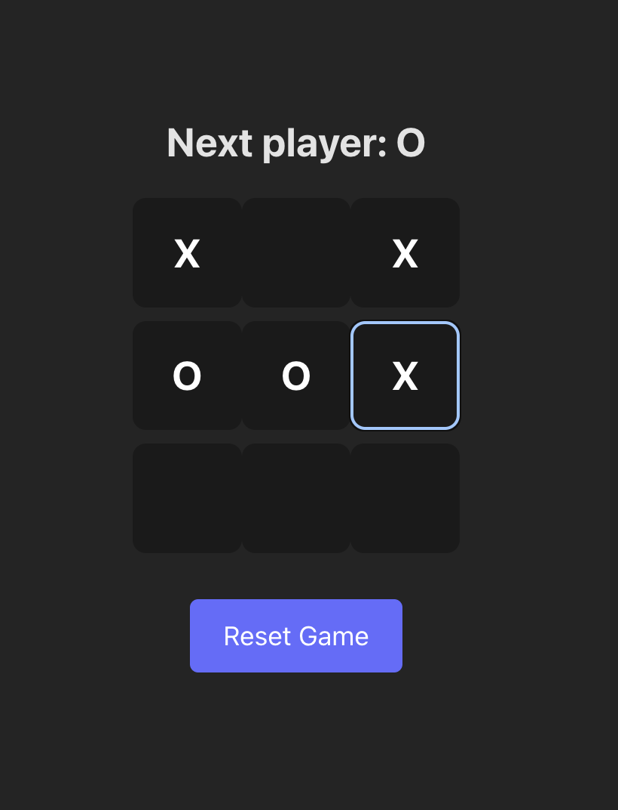

# WAD 301 ReactJS (W1D4 - Tic-Tac-Toe)

Here we are going to make a Tic-Tac-Toe game using React, Vite, and TypeScript.

The example is from the official documentation itself, which can be found [here](https://react.dev/learn/tutorial-tic-tac-toe).

Below is the final version we want to achieve:

Live URL : [https://w1d4-tictactoe.vercel.app/](https://w1d4-tictactoe.vercel.app/)